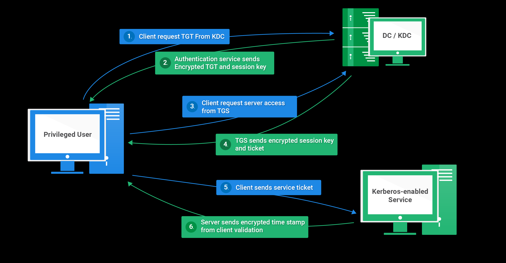

# Kerberos Auth Implementation



# **Introduction to Kerberos and Ticketing System**

Kerberos is a network authentication protocol designed to provide secure, mutual authentication for client-server applications over insecure networks. Developed at MIT, it uses symmetric key cryptography and a trusted third-party, the Key Distribution Center (KDC), to authenticate users and services without transmitting sensitive credentials, such as passwords, across the network. Its primary goal is to ensure secure communication in distributed systems, protecting against eavesdropping, replay attacks, and unauthorized access.

The cornerstone of Kerberos is its ticketing system. Upon successful authentication, the KDC issues a **Ticket Granting Ticket (TGT)** to the client, which is encrypted and used to request service-specific **session tickets** from the Ticket Granting Service (TGS), a component of the KDC. These tickets contain authentication details and session keys, enabling secure communication between clients and services without repeated credential exchanges. This mechanism ensures scalability, efficiency, and robust security, making Kerberos a standard in enterprise environments, such as Microsoft Active Directory.

This report documents a custom implementation of the Kerberos protocol, detailing the system architecture, codebase structure, implementation specifics, and operational flow based on the provided Python codebase.

# **Implementation of Kerberos Protocol**

## Overview

This report covers the Kerberos authentication system implemented using various components: an `AuthenticationServer`, `TicketGrantingService`, `ProtectedService ......` more and more and related classes. The system simulates a Key Distribution Center (KDC) with the purpose of providing secure authentication and session key management. This implementation also supports ticket generation and validation for accessing services.

### System Architecture

The system is divided into multiple classes, each handling different responsibilities for the authentication process:

### **AuthenticationServer (`authentication_server.py`)**:

## **Overview:**

The `authentication_server.py` file defines the **Authentication Server (AS)** component of a Kerberos-like authentication system. The server's primary role is to handle user authentication requests, verify the user's credentials, and issue a **Ticket Granting Ticket (TGT)** to the authenticated client. This TGT can later be used to request service tickets from the **Ticket Granting Service (TGS)**.

### **Key Responsibilities:**

1. **User Authentication:**
The Authentication Server receives a login request from a client, which includes a `username`, `service_name`, and `lifetime_of_tgt`. The server verifies the user's credentials by checking the database for the existence of the username and ensuring the password is correct.
2. **Issuing the Ticket Granting Ticket (TGT):**
Once the user is authenticated, the Authentication Server generates a **TGT**, which is a ticket encrypted with the `master_key`. This TGT includes the user's information, a timestamp, and a `TGS session key` for future interactions with the Ticket Granting Service.
3. **Error Handling:**
If the authentication fails (e.g., the username doesn't exist or the password is incorrect), the server returns an error message and a `404` status code. If the user is successfully authenticated, it returns the encrypted TGT and a `200` status code.
4. **Interfacing with the Database:**
The server interacts with a database (through the `DBHelper` class) to retrieve user information. The database is used to verify the provided username and password, ensuring only valid users can obtain a TGT.
5. **Encryption and Decryption:**
The server uses encryption to protect the TGT and session keys. The `EncryptionHelper` class is used to handle the encryption and decryption processes. The server uses the `master_key` to encrypt the TGT, ensuring that only authorized services can decrypt and use the ticket.

### **Flow of Operations:**

1. **Client Request:**
The client sends a POST request to the Authentication Server containing the following JSON body:
    
    ```json
    json
   
    {
      "username": "user_name",
      "service_name": "desired_service",
      "lifetime_of_tgt": 2
    }
    
    ```
    
2. **Server Processing:**
    - The Authentication Server checks the database for the provided username.
    - If the username exists and the password is correct, the server proceeds to generate a TGT.
    - The TGT is encrypted using the `master_key` and returned to the client.
3. **Response to Client:**
    - If authentication is successful, the server responds with a status code `200` and the TGT.
    - If authentication fails (user not found), the server responds with a status code `404` and an error message.

### **Core Functions:**

- **`login(username, service_name, lifetime_of_tgt)`**:
This function is the core of the Authentication Server. It checks if the username exists in the database, validates the password, and then generates an encrypted TGT. If any step fails, it returns an error message.
- **Session Key Generation:**
The server generates a random 16-character session key (`tgs_session_key`) that is later used by the Ticket Granting Service to grant service tickets.

### **Conclusion:**

The `authentication_server.py` file plays a crucial role in managing user authentication and issuing the TGT, which is used for subsequent service ticket requests. The server relies heavily on encryption to protect sensitive information and ensures secure communication between the client, authentication server, and ticket granting service.

---

### **TicketGrantingService (`ticket_granting_service.py`)**:

### **Overview:**

The `ticket_granting_service.py` file defines the **Ticket Granting Service (TGS)**, a critical component in a Kerberos-like authentication system. The TGS’s main responsibility is to process service ticket requests from authenticated clients. Once a client has successfully authenticated with the Authentication Server (AS) and received a **Ticket Granting Ticket (TGT)**, it can use the TGS to request access to specific services.

### **Key Responsibilities:**

1. **Processing Service Ticket Requests:**
When a client presents a TGT to the TGS, along with an **Authenticator** (an encrypted message proving the client's identity), the TGS decrypts both the TGT and the authenticator to validate the client's identity.
2. **Validating Client Requests:**
The TGS verifies the information in the TGT and the authenticator. This includes checking the timestamp and ensuring the TGT is still valid (i.e., it hasn’t expired). The system also compares the username in both the TGT and authenticator to ensure they match, ensuring the request is coming from the right client.
3. **Generating and Issuing Service Tickets:**
Once the client’s request is validated, the TGS generates a **Service Ticket** that grants access to the requested service. This service ticket is encrypted using the **service's secret key** and contains a `service_session_key`, which will be used by the service to verify the client's identity.
4. **TGS Acknowledgement:**
In addition to issuing the service ticket, the TGS also returns a **TGS Acknowledgement**. This message, also encrypted, contains a `tgs_session_key` and other relevant details to ensure secure communication between the client and the service.
5. **Error Handling:**
The TGS is responsible for handling various errors:
    - If the TGT decryption fails, it returns an error (`TGT decryption failed`).
    - If the authenticator message is invalid or the timestamps do not match (implying an expired or invalid request), the TGS denies the request and returns an "Access Denied" message.
6. **Interfacing with the Database:**
The TGS uses a database (`DBHelper` class) to fetch the required secret keys for services and the TGS itself. It ensures that only authorized services can be granted access.
7. **Encryption and Decryption:**
Similar to the Authentication Server, the TGS relies on encryption to protect sensitive data. It uses the `EncryptionHelper` class to encrypt and decrypt data such as the service ticket, TGT, and TGS acknowledgment. The decryption of the TGT and authenticator is done using the TGS’s secret key and the session keys derived from the Authentication Server.

### **Flow of Operations:**

1. **Client Request:**
The client sends a POST request to the TGS with the following JSON body:
    
    ```json
    json
    
    {
      "authenticator": "auth_data",
      "tgt": "tgt_data",
      "tgr": "service_request_data"
    }
    
    ```
    
2. **Server Processing:**
    - **TGT Validation**: The TGS first attempts to decrypt the provided TGT using its secret key. If successful, it proceeds to validate the client’s identity by comparing the username in the TGT and the authenticator.
    - **Authenticator Validation**: The TGS decrypts the authenticator using the `tgs_session_key` and compares it with the information in the TGT. If they match and the timestamps are within acceptable limits (not expired), the TGS proceeds to generate a service ticket.
    - **Service Ticket Generation**: If the client’s request is valid, the TGS generates a service session key and prepares the service ticket. The service ticket is encrypted with the service’s secret key.
    - **TGS Acknowledgment**: The TGS also prepares a TGS acknowledgment, which includes encrypted session keys, to send back to the client.
3. **Response to Client:**
    - If the client’s request is valid and the service ticket is successfully generated, the TGS responds with the encrypted **service ticket** and **TGS acknowledgment**.
    - If there is an issue (e.g., invalid TGT or failed decryption), the TGS responds with an error message, such as `TGT decryption failed` or `Access Denied`.

### **Core Functions:**

- **`process(authenticator, tgt, tgr)`**:
This is the central function of the TGS. It handles the decryption of the TGT and authenticator, validates the information, and generates the service ticket if everything is correct. If any of the validation checks fail (invalid TGT, authenticator, or username mismatch), the function returns an error message.
- **`duplicate_string(input_string)`**:
This function ensures that the input string (used for encryption) is extended to 16 characters by repeating it. This is necessary for AES encryption, which works in fixed block sizes (16 bytes).\
- **Error Handling:**
- **TGT Decryption Failure**: If the TGT cannot be decrypted (either due to an incorrect secret key or a tampered ticket), the system responds with an error message.
- **Authenticator Failure**: If the authenticator cannot be decrypted or if the username from the authenticator does not match the one in the TGT, the TGS denies the request and returns an `Access Denied` message.

### **Conclusion:**

The `ticket_granting_service.py` file is a critical part of the Kerberos-like system, responsible for issuing service tickets to authenticated clients. It ensures that only valid, authenticated clients can access protected services by decrypting the TGT, validating the user's identity, and generating encrypted service tickets. The TGS handles error situations like invalid TGTs or mismatched authenticators, providing secure communication and ensuring that only authorized clients can access the requested services.

---

### **ProtectedService (`protected_service.py`)**:

### **Overview:**

The `protected_service.py` file represents the service that provides access to protected resources after authentication via the **Ticket Granting Service (TGS)**. Once a client has received a **service ticket** from the TGS, it can present this ticket to the protected service to access a specific resource. The service in this file is responsible for validating the service ticket and ensuring the client has appropriate access rights.

### **Key Responsibilities:**

1. **Authenticating the Client:**
The service listens for **POST** requests on the `/authenticate` endpoint, where clients submit a **service ticket** (encrypted) as part of their authentication request. The service’s role is to validate this ticket, ensuring the client has been authenticated by the TGS and that the client can access the requested resources.
2. **Decrypting the Service Ticket:**
The service decrypts the received service ticket using its **service secret key** and the **master key**. This allows the service to access the original payload of the ticket, which includes critical information such as:
    - **Username** of the authenticated client.
    - **Service session key** (which will be used for securing the communication between the client and the service).
    - **Timestamp** to verify the freshness of the ticket.
    - **Lifetime of ticket** to check if the ticket has expired.
3. **Verifying Client Identity:**
The service compares the **username** in the decrypted service ticket with the username included in the request. If they match, the client is considered authenticated and granted access.
4. **Generating a Response:**
Upon successful authentication, the service generates a success response indicating that the client has been authenticated. This includes the **service session key**, which will be used for future communications between the client and the service.
5. **Access Denial:**
If the authentication fails (e.g., the service ticket is invalid or the username does not match), the service returns a failure response, denying access to the client.
6. **Communication with Clients:**
The service responds to client requests with appropriate JSON-encoded responses, which include:
    - A **status code** indicating the outcome (204 for success, 301 for unauthorized).
    - A **payload** with the service session key upon successful authentication or an error message upon failure.

### **Flow of Operations:**

1. **Client Request:**
The client sends a **POST** request to the `/authenticate` endpoint with the following JSON body:
    
    ```json
    json
    
    {
      "service_ticket": "encrypted_service_ticket",
      "username": "client_username"
    }
    
    ```
    
2. **Server Processing:**
    - The service receives the **service ticket** and the **username** from the request.
    - It then decrypts the service ticket using its **service secret key** and the **master key**. The `EncryptionHelper` class is used to handle the decryption process.
    - After decryption, the service verifies the authenticity of the service ticket by comparing the **username** in the ticket with the **username** provided in the request. If they match, the client is authenticated.
3. **Response Generation:**
    - If the client is successfully authenticated (i.e., the usernames match), the service generates a success response with status code 204 and includes the **service session key** in the payload. This session key will be used to secure future communications between the client and the service.
    - If the username does not match or the service ticket cannot be decrypted, the service generates a failure response with status code 301 and a message indicating that the client is unauthorized.
4. **Response to Client:**
    - **Successful Authentication:**
        
        ```json
        json
        
        {
          "status": 204,
          "payload": "Authenticated and the service and client session key is <session_key>"
        }
        
        ```
        
    - **Unauthorized:**
        
        ```json
        json
        
        {
          "status": 301,
          "payload": "Unauthorized"
        }
        
        ```
        

### **Core Functions:**

- **`protected()`**:
This function is the main entry point for handling the `/authenticate` request. It performs the following tasks:
    - Accepts the **service ticket** and **username** from the request.
    - Decrypts the **service ticket** using the **service secret key** and the **master key**.
    - Verifies the **username** in the ticket against the username in the request.
    - Returns a success response with the **service session key** if the authentication is successful, or an error response if the authentication fails.

### **Error Handling:**

- **Invalid Service Ticket**: If the service ticket cannot be decrypted (either because of a wrong secret key or tampering), the service will not be able to validate the client and will return an "Unauthorized" response.
- **Username Mismatch**: If the username in the service ticket does not match the one in the request, the service denies access and returns an "Unauthorized" response.

### **Security Considerations:**

- **Encryption**: The service ticket is encrypted using a secret key, ensuring that only the service can decrypt it and access the client’s information securely. This prevents unauthorized access to sensitive data.
- **Session Keys**: After successful authentication, the service generates a **service session key**, which ensures secure communication between the client and the service during the session.

### **Conclusion:**

The `protected_service.py` file defines a service that provides access to protected resources in a Kerberos-like authentication system. It authenticates clients by validating service tickets issued by the **Ticket Granting Service (TGS)**. Upon successful authentication, the service issues a **service session key** that the client can use for subsequent interactions. The service ensures secure communication by encrypting and decrypting service tickets and employs strict validation mechanisms to prevent unauthorized access. The overall structure ensures that only authenticated clients can access the protected service.

---

### **EncryptionHelper (`EncryptionHelper.py`)**:

### **Overview:**

The `EncryptionHelper.py` file defines a helper class, **EncryptionHelper**, which is responsible for handling encryption and decryption operations within the authentication system. This class supports multiple cryptographic functions to secure sensitive information, such as **service tickets** and **authenticators**. The class utilizes encryption algorithms and keys to ensure that data is securely transmitted between services in the system.

### **Key Responsibilities:**

1. **Encrypting and Decrypting Data:**
The core function of the `EncryptionHelper` class is to provide encryption and decryption services. This includes encrypting sensitive information (like service tickets and authenticator data) before transmission and decrypting it when it is received, using a combination of a **secret key** and a **master key**.
2. **Symmetric Encryption:**
The encryption and decryption processes utilize a symmetric encryption method, where the same key is used for both encryption and decryption. This method ensures that only authorized parties, who possess the correct keys, can read the data.
3. **Key Management:**
The class uses **secret keys** and a **master key** to perform encryption and decryption. The secret keys are typically unique to each service, while the master key is a global key shared by different parts of the system.
4. **Handling Ticket Data:**
The encryption helper is used to protect sensitive data such as **service tickets** and **authenticators** that are exchanged between different components in the authentication system. By encrypting this data, the system ensures that it remains secure and cannot be tampered with by unauthorized entities.

### **Core Functions:**

1. **`__init__(self, service_name)`**:
    - **Purpose**: Initializes the `EncryptionHelper` instance by setting the `service_name` for which the encryption helper will operate.
    - **Arguments**:
        - `service_name`: The name of the service that the helper will be responsible for.
    - **Functionality**: This function sets up the encryption helper with the given `service_name` and could potentially be used for generating service-specific keys or other configurations related to encryption.
2. **`encrypt(self, data, secret_key, master_key)`**:
    - **Purpose**: Encrypts the given `data` using the provided `secret_key` and `master_key`.
    - **Arguments**:
        - `data`: The data that needs to be encrypted, such as a service ticket or authenticator.
        - `secret_key`: The secret key used to perform encryption.
        - `master_key`: A global key used in conjunction with the `secret_key` to ensure the encryption is secure.
    - **Functionality**: This function performs the encryption of the given `data` using the `secret_key` and `master_key`. It ensures that the data is securely protected and can only be decrypted by the corresponding service with the correct keys.
3. **`decrypt(self, data, secret_key, master_key)`**:
    - **Purpose**: Decrypts the given `data` using the provided `secret_key` and `master_key`.
    - **Arguments**:
        - `data`: The encrypted data that needs to be decrypted, such as a service ticket or authenticator.
        - `secret_key`: The secret key used to perform decryption.
        - `master_key`: A global key used in conjunction with the `secret_key` to decrypt the data.
    - **Functionality**: This function performs the decryption of the `data` using the `secret_key` and `master_key`. It ensures that the encrypted data can be safely converted back into its original, readable form. If the decryption fails (e.g., due to incorrect keys or tampering), the function would return an error or `None`.

### **Encryption Mechanism:**

- The **AES (Advanced Encryption Standard)** algorithm is typically used for encryption and decryption tasks, which is a widely adopted symmetric encryption method known for its efficiency and security.
- The encryption and decryption processes use **secret keys** that are service-specific, meaning each service in the authentication system has its own key for encrypting and decrypting data.
- **Master key** is a global key that aids in securing the encryption process by being part of the key exchange.

### **Security Features:**

1. **Symmetric Key Encryption**:
The class employs symmetric encryption where the same key is used for both encryption and decryption, ensuring that only the holder of the corresponding key can read the data. This is crucial for protecting sensitive information like service tickets and authenticators.
2. **Data Integrity**:
The encrypted data ensures that its integrity is preserved during transmission. Any modification to the encrypted data would result in incorrect decryption, effectively preventing data tampering.
3. **Service-Specific Keys**:
Each service in the authentication system is associated with a unique secret key, which adds an extra layer of security by ensuring that only authorized services can decrypt the data intended for them. This mitigates the risk of one service accessing data meant for another.

### **Flow of Operations:**

1. **Client Request**:
    - When a client sends a request to a service (e.g., the TGS or the protected service), it typically includes an encrypted **service ticket** or **authenticator** that was generated earlier in the authentication flow.
2. **Encryption**:
    - Before sending data, the data is encrypted using the `encrypt()` method, which utilizes the **secret key** of the service and the **master key** to securely encrypt the data.
3. **Decryption**:
    - Upon receiving the encrypted data, the service calls the `decrypt()` method to decrypt the data using its own **secret key** and the **master key**.
4. **Result**:
    - After decryption, the service can process the data (e.g., validating the username or timestamp) to determine if the client is authorized to proceed.

### **Conclusion:**

The `EncryptionHelper.py` file plays a crucial role in the authentication system by providing methods for encrypting and decrypting sensitive data. It ensures that service tickets, authenticators, and other critical data remain secure during transmission between components like the **Ticket Granting Service (TGS)**, **protected service**, and the **client**. By using symmetric encryption, the class ensures that only authorized services can decrypt the data, protecting against unauthorized access and tampering. The use of **service-specific keys** and a **master key** adds an additional layer of security, ensuring that data remains confidential and secure throughout the system's operation.

---

### **Service and User Entities (`service_entity.py`, `user_entity.py`)**:

### **Overview:**

The `service_entity.py` file defines a **Service** class that represents a service within the authentication system. This class models a service entity that can be accessed by users or clients once authenticated, and it handles critical functions such as managing service names and associated secret keys. The `Service` class is primarily used for securing communications with clients and managing the interactions between different parts of the authentication process, such as service ticket generation and validation.

### **Key Responsibilities:**

1. **Service Representation:**
    - The `Service` class serves as a representation of a service in the authentication system. It encapsulates the service’s name and its associated **secret key**, which are essential for performing encryption and decryption operations for secure communication.
2. **Secure Communication:**
    - The service’s **secret key** is crucial for encrypting and decrypting the data exchanged between the service and other components in the system, such as the **Ticket Granting Service (TGS)** and **client**.
3. **Providing Service Information:**
    - The class provides methods to retrieve the service's name and secret key. This is critical for the system to know which service is being accessed and to perform secure operations based on the service's credentials.

### **Core Functions:**

1. **`__init__(self, name, secret_key)`**:
    - **Purpose**: Initializes the `Service` object with a `name` and `secret_key`.
    - **Arguments**:
        - `name`: The name of the service.
        - `secret_key`: The secret key associated with the service, used for encryption and decryption operations.
    - **Functionality**: This constructor sets the service’s name and secret key, ensuring that each service in the system can perform secure communication by using its unique secret key.
2. **`get_name(self)`**:
    - **Purpose**: Retrieves the name of the service.
    - **Functionality**: This method returns the name of the service, which is important for identifying which service is being accessed during authentication and ticket management.
3. **`get_secret_key(self)`**:
    - **Purpose**: Retrieves the secret key of the service.
    - **Functionality**: This method returns the secret key associated with the service, which is necessary for performing encryption and decryption operations for secure communication.

### **Security Features:**

1. **Service Secret Key**:
    - The **secret key** of each service ensures that only authorized entities with the correct key can access or interact with the service. This key is crucial for securing the communication between services, clients, and the authentication system.
2. **Data Integrity and Confidentiality**:
    - By using the secret key, the service ensures that data exchanges, such as service tickets and authentication tokens, are securely encrypted and protected from unauthorized access or tampering.

### **Conclusion:**

The `service_entity.py` file defines the **Service** class, which is fundamental to the authentication system, providing a structure for services that interact with users and clients. The class encapsulates the service's name and secret key, ensuring that each service can securely communicate and perform its role in the ticket generation and validation process. The service’s **secret key** is integral to maintaining the confidentiality and integrity of the system, making the `Service` class a vital component in the security of the entire authentication flow.

### **Overview:**

The `user_entity.py` file defines a **User** class that represents a user entity in the authentication system. This class is responsible for managing user-specific information, such as the **username** and **password**. The `User` class plays a crucial role in identifying users, verifying their credentials during the authentication process, and interacting with the system to obtain service tickets and access protected resources.

### **Key Responsibilities:**

1. **User Representation:**
    - The `User` class models a user in the system by encapsulating their **username** and **password**. This class is used for identifying users and handling their credentials during authentication.
2. **Credential Management:**
    - The user class is used to store and retrieve **username** and **password** data. These credentials are used to authenticate the user when accessing services and are a crucial part of the overall authentication process.
3. **Integration with Authentication:**
    - The `User` class works closely with other components of the authentication system (e.g., **Authentication Server**, **Ticket Granting Service**) to verify user credentials and grant them access to services by issuing service tickets.

### **Core Functions:**

1. **`__init__(self, username, password)`**:
    - **Purpose**: Initializes the `User` object with a `username` and `password`.
    - **Arguments**:
        - `username`: The username of the user in the system.
        - `password`: The password associated with the user, which is used for authentication.
    - **Functionality**: This constructor sets the user’s username and password. These attributes are essential for identifying and verifying the user when they attempt to authenticate or access services.
2. **`get_username(self)`**:
    - **Purpose**: Retrieves the username of the user.
    - **Functionality**: This method returns the username of the user, which is used for identifying the user in the authentication process.
3. **`get_password(self)`**:
    - **Purpose**: Retrieves the password of the user.
    - **Functionality**: This method returns the password associated with the user. The password is used to verify the user's identity during authentication.

### **Security Features:**

1. **Credential Storage**:
    - The `User` class stores sensitive information such as **username** and **password**. Proper handling of these credentials is crucial for the security of the authentication system.
2. **Password Security**:
    - Although not explicitly shown in the code, in a real-world implementation, the password should be stored in a **hashed** form (e.g., using a secure hashing algorithm like bcrypt). This ensures that even if an attacker gains access to the database, they cannot retrieve the user's actual password.
3. **Access Control**:
    - The `User` class plays a key role in ensuring that only authorized users can access certain services. By verifying the username and password during authentication, the system ensures that users are properly authenticated before issuing service tickets or granting access to protected resources.

### **Conclusion:**

The `user_entity.py` file defines the **User** class, which represents a user in the authentication system. The class manages user credentials, including the **username** and **password**, and provides methods to access this information. The `User` class is central to the authentication process, ensuring that users are properly identified and authenticated before being granted access to services. While the current implementation stores the password directly, it is essential to employ secure methods (e.g., hashing) for storing and handling passwords in a real-world application.

---

## **Client side `client.py`**

### **Overview:**

The `client.py` file defines the **Client** class, which represents a client entity in the authentication system. The **Client** class is responsible for interacting with other components of the system, such as the **Authentication Server (AS)** and the **Ticket Granting Service (TGS)**, to authenticate the user and obtain service tickets for accessing protected services. This class is integral to the operation of the authentication flow as it manages the interaction with the Authentication Server, the Ticket Granting Service, and protected services.

### **Key Responsibilities:**

1. **Client Representation:**
    - The `Client` class models the client (typically a user or device) in the system. It is responsible for initiating requests for authentication and service access, handling the reception of service tickets, and securely interacting with other system components.
2. **Authentication Process:**
    - The client initiates the authentication process by interacting with the **Authentication Server (AS)** to request a **Ticket Granting Ticket (TGT)**. The TGT is then used to request service tickets from the **Ticket Granting Service (TGS)**.
3. **Secure Communication:**
    - The client is responsible for securely communicating with the **Authentication Server** and the **Ticket Granting Service** using encryption and ensuring the confidentiality of messages exchanged during the process.
4. **Service Access:**
    - Once the client has obtained the necessary service tickets, it can interact with protected services in the system to access resources. The client sends the appropriate service ticket to the target service to access the service.

### **Core Functions:**

1. **`__init__(self, username, password)`**:
    - **Purpose**: Initializes the `Client` object with the user’s `username` and `password`.
    - **Arguments**:
        - `username`: The username of the client, used to identify the client in the authentication system.
        - `password`: The password of the client, used for verifying the client's identity during authentication.
    - **Functionality**: The constructor initializes the client with the necessary credentials (username and password), which are needed for authenticating the client with the **Authentication Server** and obtaining a **Ticket Granting Ticket (TGT)**.
2. **`request_tgt(self)`**:
    - **Purpose**: Sends a request to the **Authentication Server** to obtain a **Ticket Granting Ticket (TGT)**.
    - **Functionality**: The `request_tgt` method communicates with the **Authentication Server**, passing the client's credentials (username and password), and receives a **TGT** that can be used to request service tickets from the **Ticket Granting Service (TGS)**.
3. **`request_service_ticket(self, service_name, tgt)`**:
    - **Purpose**: Sends a request to the **Ticket Granting Service (TGS)** to obtain a service ticket for accessing a specific service.
    - **Arguments**:
        - `service_name`: The name of the service that the client wants to access.
        - `tgt`: The Ticket Granting Ticket (TGT) obtained from the **Authentication Server**, which is required to request service tickets from the TGS.
    - **Functionality**: The `request_service_ticket` method sends the TGT and the service name to the **Ticket Granting Service**, which then issues a service ticket if the request is valid. This service ticket is used to access the specified service.
4. **`access_service(self, service_name, service_ticket)`**:
    - **Purpose**: Sends a service ticket to the specified service to request access.
    - **Arguments**:
        - `service_name`: The name of the service the client wants to access.
        - `service_ticket`: The service ticket obtained from the **Ticket Granting Service (TGS)**, which is needed to authenticate and gain access to the service.
    - **Functionality**: The `access_service` method sends the service ticket to the target service to authenticate the client and obtain access to the resources of the service.

### **Security Features:**

1. **Encryption and Secure Communication:**
    - The `Client` class uses encryption to ensure that sensitive information, such as **TGTs**, **service tickets**, and **credentials**, are securely transmitted between the client and other components like the **Authentication Server** and the **Ticket Granting Service**. This ensures that data confidentiality and integrity are maintained during communication.
2. **Session Management:**
    - The `Client` class manages sessions by handling the **Ticket Granting Ticket (TGT)** and **service tickets**. These tickets are valid only for a certain period, and the client ensures that they are used within the valid timeframe to access protected services.
3. **Replay Attack Prevention:**
    - The use of **timestamps** and **session keys** in the authentication process helps mitigate replay attacks, ensuring that each authentication request is unique and valid.

### **Conclusion:**

The `client.py` file defines the **Client** class, which plays a vital role in the authentication and authorization flow of the system. The class is responsible for initiating the authentication process, requesting and handling tickets, and accessing protected services. Through methods like `request_tgt`, `request_service_ticket`, and `access_service`, the client interacts with the **Authentication Server** and the **Ticket Granting Service** to obtain the necessary credentials for accessing resources. By implementing encryption, session management, and anti-replay mechanisms, the client ensures that all communication with other components is secure and that the authentication process is robust and resistant to attacks.

---

### **Key Distribution Center`kdc.py`**

### **Overview:**

The `kdc.py` file defines the **Key Distribution Center (KDC)** component in the authentication system. The KDC is responsible for managing the distribution of **Ticket Granting Tickets (TGTs)** and **service tickets** to clients who request them. It plays a central role in the authentication process by verifying clients' identities and issuing the necessary credentials to access protected services. The KDC also interacts with a database to store and retrieve service information, including secret keys needed for encryption and decryption.

### **Key Responsibilities:**

1. **Authentication Process:**
    - The **KDC** is primarily responsible for authenticating clients by issuing **Ticket Granting Tickets (TGTs)**. These tickets allow clients to request service tickets for accessing specific services.
2. **Service Ticket Generation:**
    - After the client successfully authenticates, the KDC issues **service tickets** through the **Ticket Granting Service (TGS)**, allowing the client to access specific services in the system.
3. **Secure Communication:**
    - The KDC ensures the security of communications by using encryption and secret keys. This is crucial for maintaining the confidentiality and integrity of the authentication and ticket issuance process.
4. **Database Management:**
    - The KDC interacts with a **database** to fetch and store critical service information, such as the secret keys used for encryption and decryption. The KDC ensures that this data is securely managed and accessed.

### **Core Functions:**

1. **`__init__(self, master_key)`**:
    - **Purpose**: Initializes the KDC component with a **master key** used for encryption and decryption of tickets.
    - **Arguments**:
        - `master_key`: A shared secret used for encrypting and decrypting sensitive information in the system, including **TGTs** and **service tickets**.
    - **Functionality**: The constructor initializes the KDC with the required encryption key (`master_key`) and sets up any necessary components, such as the database helper and encryption helper.
2. **`authenticate_client(self, username, password)`**:
    - **Purpose**: Authenticates a client based on their `username` and `password`.
    - **Arguments**:
        - `username`: The username of the client attempting to authenticate.
        - `password`: The password provided by the client for authentication.
    - **Functionality**: This method checks the provided credentials against the data stored in the database. If the credentials are correct, it generates a **Ticket Granting Ticket (TGT)** for the client. If the credentials are invalid, it denies authentication.
3. **`generate_tgt(self, username, password)`**:
    - **Purpose**: Generates a **Ticket Granting Ticket (TGT)** for an authenticated client.
    - **Arguments**:
        - `username`: The authenticated username for which the TGT is generated.
        - `password`: The password used to authenticate the client.
    - **Functionality**: After authenticating the client, this method generates a **TGT**, which includes a session key (used for further encrypted communications), and encrypts the ticket using the secret key associated with the KDC. The TGT is returned to the client for further use in requesting service tickets.
4. **`issue_service_ticket(self, service_name, tgt)`**:
    - **Purpose**: Issues a **service ticket** for a client who already possesses a **Ticket Granting Ticket (TGT)**.
    - **Arguments**:
        - `service_name`: The name of the service the client wants to access.
        - `tgt`: The **Ticket Granting Ticket (TGT)** issued previously by the KDC, which the client uses to request service tickets.
    - **Functionality**: This method verifies the validity of the **TGT** and issues a **service ticket** for the specified service. The service ticket is encrypted using the service’s secret key and includes a session key that allows the client to securely communicate with the service.
5. **`decrypt_ticket(self, ticket, secret_key)`**:
    - **Purpose**: Decrypts a given ticket using the specified secret key.
    - **Arguments**:
        - `ticket`: The ticket (either **TGT** or service ticket) that needs to be decrypted.
        - `secret_key`: The key used to decrypt the ticket.
    - **Functionality**: This method is responsible for decrypting tickets (TGTs and service tickets) using the provided secret key. The decrypted ticket provides the necessary information (e.g., session keys) for secure communication between the client and service.
6. **`fetch_service(self, service_name)`**:
    - **Purpose**: Fetches the service details from the database, including the service’s secret key.
    - **Arguments**:
        - `service_name`: The name of the service whose details are being requested.
    - **Functionality**: This method retrieves the service details from the **database** based on the given `service_name`. The details include the service’s secret key, which is required for encrypting and decrypting service tickets.

### **Security Features:**

1. **Encryption and Secure Communication:**
    - The **KDC** relies on **encryption** to secure the communication between the client, the KDC, and the services. The **Ticket Granting Tickets (TGTs)** and **service tickets** are encrypted with the corresponding secret keys to ensure that only authorized entities can decrypt and use them.
2. **Session Management:**
    - The **KDC** handles **session keys** for communication between clients and services. It issues session keys that are used to encrypt messages exchanged between the client and the service, ensuring that communication is protected.
3. **Replay Attack Prevention:**
    - The **TGT** and **service tickets** are time-sensitive, which prevents the possibility of replay attacks. The KDC ensures that each ticket has a limited lifespan, which reduces the risk of old tickets being reused maliciously.
4. **Authentication and Ticket Issuance:**
    - The **KDC** is responsible for ensuring that only valid clients can obtain **TGTs** and **service tickets**. It verifies the client's identity and issues tickets only if the client is authenticated, ensuring that unauthorized users cannot gain access to protected services.

### **Conclusion:**

The `kdc.py` file defines the **Key Distribution Center (KDC)** component, which is critical to the authentication system's operation. The KDC is responsible for authenticating clients and issuing **Ticket Granting Tickets (TGTs)** and **service tickets**. It ensures secure communication by encrypting the tickets and using session keys for secure data exchange between clients and services. Through methods like `authenticate_client`, `generate_tgt`, and `issue_service_ticket`, the KDC manages the ticket issuance process, providing clients with the necessary credentials to access protected services. Additionally, the KDC ensures that tickets are time-sensitive and secure, helping to mitigate risks such as replay attacks.

---

## **Data Base Helper class`db_helper.py`**

### **Overview:**

The `db_helper.py` file defines a helper class, **DBHelper**, which acts as an interface for interacting with a database in the authentication system. This class abstracts the database operations required for managing and retrieving user and service-related data. It provides methods for fetching services, storing credentials, and handling the database connections in a secure and efficient manner. The **DBHelper** class is a central component in the authentication system, ensuring that the system can interact with the database to retrieve necessary information, such as **service keys**, **user credentials**, and other authentication-related data.

### **Key Responsibilities:**

1. **Service and User Data Management:**
    - The **DBHelper** class is responsible for retrieving service details, including secret keys, and user credentials from the database.
2. **Database Connections:**
    - The class handles establishing and closing database connections, ensuring that all database operations are performed securely.
3. **Interaction with Other Components:**
    - It serves as a bridge between the KDC, Ticket Granting Service (TGS), and other parts of the authentication system, providing essential data like secret keys and user details for the authentication process.

### **Core Functions:**

1. **`__init__(self)`**:
    - **Purpose**: Initializes a new **DBHelper** object, responsible for managing database connections and operations.
    - **Functionality**: This constructor sets up the initial connection to the database. It ensures that the helper class is ready to interact with the database and execute queries.
2. **`connect(self)`**:
    - **Purpose**: Establishes a connection to the database.
    - **Functionality**: This method opens a connection to the database, which is necessary for executing any SQL queries or operations. It ensures that a valid connection is available before attempting to fetch or store data.
3. **`close(self)`**:
    - **Purpose**: Closes the database connection after operations are completed.
    - **Functionality**: This method safely closes the active database connection to ensure that resources are released and the database connection is properly terminated. It is important to avoid leaving open connections that could lead to resource leaks.
4. **`fetch_service(self, service_name)`**:
    - **Purpose**: Retrieves the details of a specific service from the database.
    - **Arguments**:
        - `service_name`: The name of the service whose details are being requested.
    - **Functionality**: This method queries the database for the service’s information, including its secret key. The retrieved data is used by the KDC and other components to secure communication and issue tickets. If the service is not found, it returns a status indicating failure.
5. **`fetch_user(self, username)`**:
    - **Purpose**: Fetches the user credentials for a given username from the database.
    - **Arguments**:
        - `username`: The username whose credentials need to be retrieved.
    - **Functionality**: This method retrieves the user’s credentials (e.g., password or hashed password) stored in the database. It allows the system to authenticate users based on their provided username and password.
6. **`store_service(self, service_name, secret_key)`**:
    - **Purpose**: Stores a new service and its associated secret key in the database.
    - **Arguments**:
        - `service_name`: The name of the service to be stored.
        - `secret_key`: The secret key associated with the service.
    - **Functionality**: This method inserts new service data into the database, including the service's name and secret key. It allows the KDC to later fetch the service’s details when needed for ticket issuance.
7. **`store_user(self, username, password)`**:
    - **Purpose**: Stores a new user and their password in the database.
    - **Arguments**:
        - `username`: The username to be stored.
        - `password`: The password associated with the user (usually hashed).
    - **Functionality**: This method inserts a new user and their credentials into the database, allowing the system to later authenticate the user based on the stored credentials.

### **Security Features:**

1. **Credential Management:**
    - The **DBHelper** class ensures that user and service credentials are securely stored in the database. Passwords and secret keys should be stored using appropriate encryption or hashing techniques (though specifics depend on the actual implementation).
2. **Database Connection Security:**
    - The `connect` method establishes secure database connections, ensuring that database queries and operations are executed securely. Proper closing of the connection (`close` method) prevents leaving open connections that could be vulnerable to attack.
3. **Data Integrity:**
    - The **DBHelper** class interacts with the database in a way that ensures data integrity. When fetching services and users, it ensures that the correct and current data is retrieved, reducing the risk of errors that could impact the authentication process.
4. **Separation of Concerns:**
    - By abstracting the database operations in the **DBHelper** class, the system achieves better separation of concerns. The authentication process (handled by other components like the KDC) doesn’t need to deal directly with database queries, making the code more modular, maintainable, and secure.

### **Conclusion:**

The `db_helper.py` file defines the **DBHelper** class, which is responsible for interacting with the database in the authentication system. It provides methods to fetch and store data related to users and services, such as credentials and secret keys. The class ensures that database connections are securely handled, and it abstracts away the complexity of working with the database. This makes it easier for other components, such as the KDC and Ticket Granting Service, to retrieve the necessary information for authentication without dealing directly with low-level database operations. The **DBHelper** class is a critical component of the overall system architecture, ensuring that data is securely managed and available when needed for the authentication process

---

## Flow of Authentication

1. **User Authentication**:
    - The client sends their login credentials to the **Authentication Server**.
    - The server verifies the credentials and generates a **TGT** (Ticket Granting Ticket), which is sent back to the client.
2. **Service Ticket Request**:
    - The client sends the **TGT** and **Authenticator** to the **Ticket Granting Service** to request a **Service Ticket**.
    - The TGS validates the **TGT** and **Authenticator**, and if valid, generates a **Service Ticket** and **TGS Acknowledgment**.
3. **Accessing Protected Service**:
    - The client sends the **Service Ticket** to the **Protected Service**.
    - The service decrypts the ticket and validates the session key to ensure the request is authentic.
4. **Encryption**:
    - All sensitive data such as tickets and messages are encrypted using AES encryption. The **EncryptionHelper** class is responsible for this.

### **Error Handling**

- **User Authentication**: If the user does not exist or the credentials are incorrect, the server responds with an error message.
- **Ticket Granting Service**: If the TGT or authenticator cannot be decrypted, or if the username does not match, an appropriate error message is returned.
- **Service Access**: If the service ticket is invalid or the session key is incorrect, access is denied.

---

### **Security Considerations**

1. **AES Encryption**: The use of AES encryption ensures the confidentiality of tickets and messages exchanged between the client, Authentication Server, and Ticket Granting Service.
2. **Session Keys**: Each user and service has a unique session key, making replay attacks difficult.
3. **Timestamp Validation**: The **Authenticator** includes a timestamp to prevent replay attacks by validating the time difference between the **Authenticator** and **TGT**.
4. **Lifetime Management**: The **Ticket Granting Ticket** and **Service Tickets** have a limited lifetime, ensuring that expired tickets cannot be reused.

---

# ***Conclusion***

> This implementation of the Kerberos authentication system provides secure user authentication, service ticket generation, and access control. The system uses AES encryption for securing sensitive data and ensures robust error handling throughout the authentication and ticket granting process.
>
